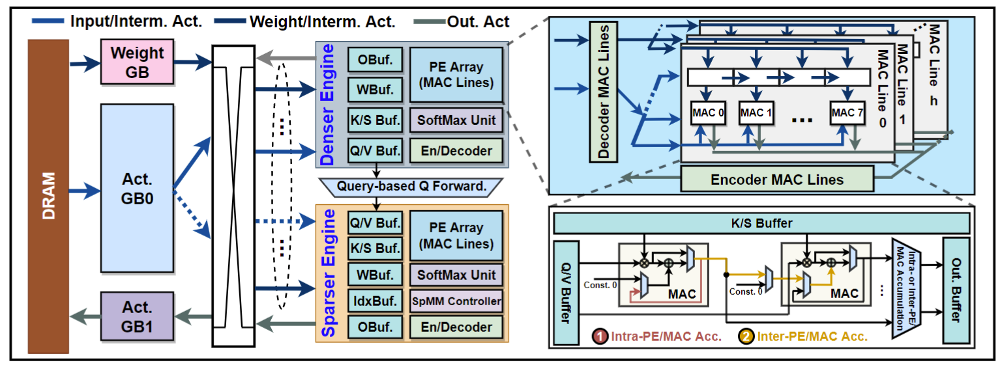
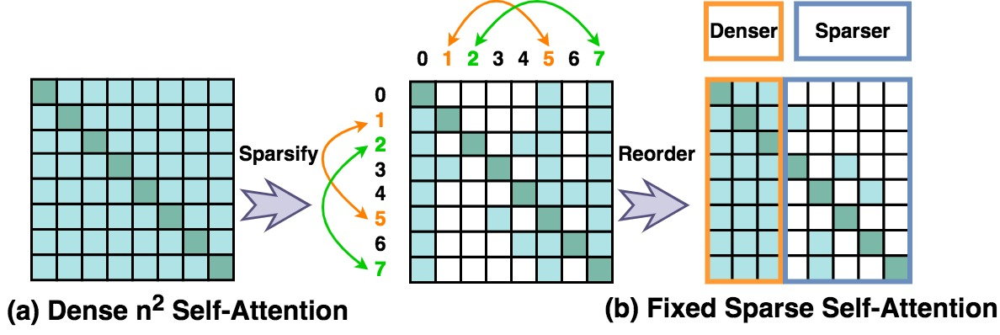

# The Hardware Simulator for ViTCoD Accelerator 
<p align="center">
    
</p>

## Polarize the sparsed attention maps

<p align="center">
    
</p>

To polarize the attention map stored in `./masks` (e.g., the attention maps of Deit-Tiny trained under 95% sparsity and stored in ./masks/deit_tiny_lowrank/info_0.95.npy) to be either denser or sparser for enhancing more regular workloads, run
````
python reorder.py
````
which correspondingly generates a numpy file (e.g., ./masks/deit_tiny_lowrank/global_token_info_0.95.npy) indicating the number of tokens in the polarized denser attention map, and a numpy file (e.g., ./masks/deit_tiny_lowrank/reodered_info_0.95) representing the sparsity pattern of polarized sparser attention map. 


## Simulate the attention latency 

To simulate the latency of attention computation, run
````
python ViTCoD.py
````
where we adopt a ***dynamic*** *PE allocation* between the ***denser*** and ***sparser engines*** to balance the workload of processing the denser and sparser patterns of different attention head, and leverage the on-chip ***decoder*** to reconstruct Q and K that are compressed by the on-chip ***encoder*** for saving data access costs. 


## Simulate the end-to-end latency 

To simulate the end-to-end latency, 
* first run
````
python ViTCoD.py
````
which simulates the latency consumed by the remaining ***linear projections*** and ***MLPs***, 
* then add the simulated latency with the previously simulated attention latency. 


---

## Citation

If you find this codebase is useful for your research, please cite:

````
@inproceedings{you2022vitcod,
  title={ViTCoD: Vision Transformer Acceleration via Dedicated Algorithm and Accelerator Co-Design},
  author={You, Haoran and Sun, Zhanyi and Shi, Huihong and Yu, Zhongzhi and Zhao, Yang and Zhang, Yongan and Li, Chaojian and Li, Baopu and Lin, Yingyan},
  booktitle={The 29th IEEE International Symposium on High-Performance Computer Architecture (HPCA-29)},
  year={2023}
}
````
