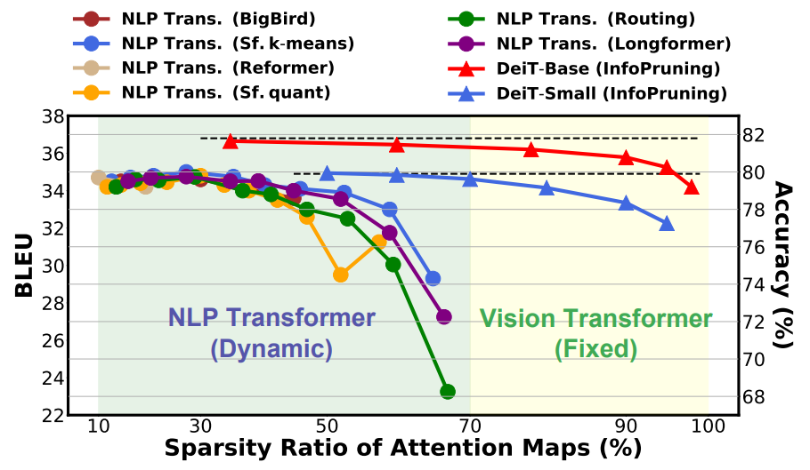
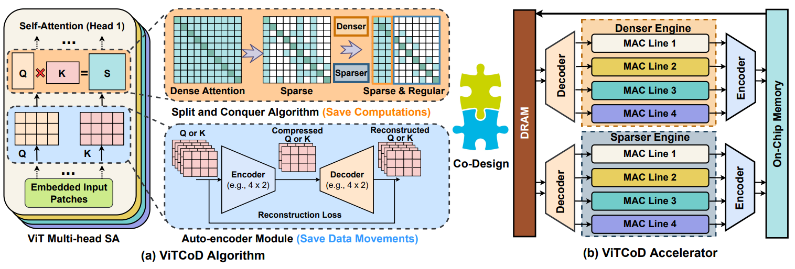

# ViTCoD: Vision Transformer Acceleration via Dedicated Algorithm and Accelerator Co-Design

[](https://opensource.org/licenses/Apache-2.0)

**Haoran You**, Zhanyi Sun, Huihong Shi, Zhongzhi Yu, Yang Zhao, Yongan Zhang, Chaojian Li, Baopu Li and Yingyan Lin

Accepted by [**HPCA 2023**](https://hpca-conf.org/2023/). More Info:
\[ [**Paper**](https://arxiv.org/abs/2210.09573) | [**Slide**](https://drive.google.com/file/d/1NIWiqxac8ufF-nzslpZzEU9ZQ69GLe2b/view?usp=share_link) | [**Youtube**]() | [**Github**](https://github.com/GATECH-EIC/ViTCoD/) \]

---

## Why We Consider ViTCoD Given NLP Transformer Accelerators?

This is because there is a large difference between ViTs and Transformers for natural language processing (NLP)
tasks: ViTs have a relatively fixed number of input tokens, whose attention maps can be pruned by up to 90% even with fixed sparse patterns, without severely hurting the model accuracy (e.g., <=1.5% under 90% pruning ratio); while NLP Transformers need to handle input sequences of varying numbers of tokens and rely on on-the-fly predictions of dynamic sparse attention patterns for each input to achieve a decent sparsity (e.g., >=50%).

<p align="center">
    
</p>

* ***New Opportunity***: The fixed sparse patterns in ViTs can alleviate the stringent need for adopting on-the-fly sparse attention pattern prediction and highly reconfigurable processing element (PE) designs.

* ***New Challenge***: ViTs' allowed high sparsity in attention maps inevitably aggravates the extent of both irregular data accesses and processing, which could incur severe workload imbalance problems. Moreover, the high sparsity can cause undesired under-utilization when processing highly sparse attention regions, where efficiency is largely bounded by memory/bandwidth due to decreased computational density. That is because the non-zero elements in sparse attention maps of ViTs mostly concentrate along the diagonal lines, i.e., the most inefficient.

---

## Overview of Our ViT Co-Design Framework

We propose a dedicated algorithm and accelerator co-design framework dubbed ViTCoD for accelerating ViTs, i.e., Vision Tranformers.

* ***On the algorithm level***, ViTCoD prunes and polarizes the attention maps to have either denser or sparser
fixed patterns for regularizing two levels of workloads without hurting the accuracy, largely reducing the attention computations while leaving room for alleviating the remaining dominant data movements; on top of that, we further integrate a lightweight and learnable auto-encoder module to enable trading the dominant high-cost data movements for lower-cost computations.

* ***On the hardware level***, we develop a dedicated accelerator to simultaneously coordinate the aforementioned enforced denser and sparser workloads for boosted hardware utilization, while integrating on-chip encoder and decoder engines to leverage ViTCoD’s algorithm pipeline for much reduced data movements.

<p align="center">
    
</p>

---

## Usage of the Provided Codebase

For reproducing the results, we provides three kinds of codebases:

* (1) algorithm codes for running models with proposed pruning technique and auto-encoders, see `./Algorithm` for detailed implementation and usages, including both [DeiT](https://arxiv.org/abs/2012.12877) and [LeViT](https://arxiv.org/abs/2104.01136) verions.

* (2) hardware simulator for estimating the cycles given sparsity ratios and patterns, see `./Hardware/Simulator` for detailed implementation and usages.

* (3) profile codes for profiling FLOPs breakdown as well as latency breakdown measured by [Nvidia TX2 EdgeGPU](https://www.nvidia.com/en-us/autonomous-machines/embedded-systems/jetson-tx2/), see `./Profile` for detailed implementation and usages.

---

## Citation

If you find this codebase is useful for your research, please cite:

````
@inproceedings{you2022vitcod,
  title={ViTCoD: Vision Transformer Acceleration via Dedicated Algorithm and Accelerator Co-Design},
  author={You, Haoran and Sun, Zhanyi and Shi, Huihong and Yu, Zhongzhi and Zhao, Yang and Zhang, Yongan and Li, Chaojian and Li, Baopu and Lin, Yingyan},
  booktitle={The 29th IEEE International Symposium on High-Performance Computer Architecture (HPCA-29)},
  year={2023}
}
````
